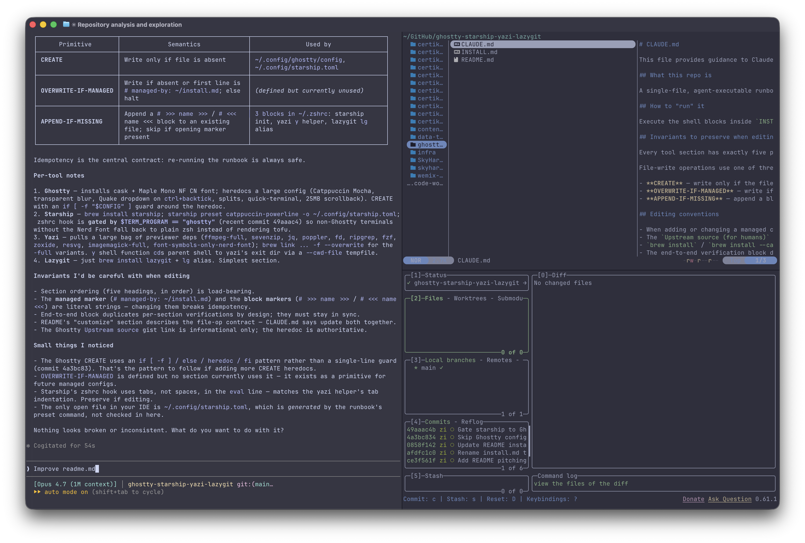

<div align="center">

# ghostty · starship · yazi · lazygit

### A macOS terminal toolchain for vibe coding with Claude Code

[](https://www.apple.com/macos/)
[](https://www.zsh.org/)
[](https://brew.sh)
[](https://catppuccin.com)
[](https://github.com/subframe7536/maple-font)
[](./INSTALL.md)

<br />



</div>

---

## Why

Claude Code lives in your terminal. If the terminal is sluggish, the prompt is noisy, and reviewing a diff means leaving the shell for a GUI, your flow state dies before the first tool use.

This repo is one runbook — [`INSTALL.md`](./INSTALL.md) — that installs a cohesive, opinionated stack:

- **[Ghostty](https://ghostty.org)** — GPU-accelerated terminal. Smooth while Claude streams tokens. Quake-style dropdown on <kbd>ctrl</kbd>+<kbd>`</kbd>, splits on <kbd>cmd</kbd>+<kbd>d</kbd>, transparent blurred titlebar.
- **[Starship](https://starship.rs)** — prompt showing git state, language, and context at a glance, so you always know what Claude is about to operate on.
- **[Yazi](https://yazi-rs.github.io)** — async file manager with image and PDF previews. The bundled `y` shell function `cd`s your parent shell to wherever you exited.
- **[Lazygit](https://github.com/jesseduffield/lazygit)** — review every diff Claude writes before it hits `main`. Stage hunks, amend, rebase, resolve conflicts — all keyboard.

Plus the modern CLI bedrock — `fd`, `ripgrep`, `fzf`, `zoxide`, `jq`, `ffmpeg`, `poppler`, `imagemagick`, `sevenzip`, `resvg` — for search, preview, and transformation.

All wired to **Catppuccin Mocha** and **Maple Mono NF CN** (ligatures, Nerd Font icons, CJK support).

---

## Install

Hand this to your coding agent:

```
Fetch and follow instructions from https://raw.githubusercontent.com/ziyi-zhang-1130/ghostty-starship-yazi-lazygit/refs/heads/main/INSTALL.md, halt if any verification fails.
```

The runbook is idempotent, so manual execution works too — open [`INSTALL.md`](./INSTALL.md) and run each shell block top to bottom.

**Prerequisites:** macOS · [Homebrew](https://brew.sh) · zsh (default on modern macOS)

**Smoke test** — after install, this must exit 0:

```sh
set -e
test -d /Applications/Ghostty.app
command -v starship >/dev/null
command -v yazi >/dev/null
command -v lazygit >/dev/null
echo "OK"
```

The canonical version lives at the bottom of `INSTALL.md`.

---

## The stack at a glance

| tool | role | why it's in here |
|------|------|------------------|
| **Ghostty** | terminal | GPU-rendered, transparent titlebar, Quake-mode dropdown, native macOS |
| **Starship** | prompt | Rust-fast, context-rich, `catppuccin-powerline` preset out of the box |
| **Yazi** | file manager | async, image & PDF previews, `y` shell helper for seamless `cd` |
| **Lazygit** | git TUI | stage hunks, amend, rebase, resolve conflicts — the interface `git` should've shipped with |

---

## Why it pairs with Claude Code

- **Fast terminal → fast feedback.** When Claude streams a long diff or runs a noisy build, Ghostty doesn't choke. You stay in the loop.
- **Ambient context.** Starship's git and language segments mean you always know which branch Claude is editing and whether there are uncommitted changes before you say "ship it."
- **Agentic review surface.** Claude writes code; `lazygit` is where you read it. Hunk-level staging catches the occasional overreach before it commits.
- **File flow.** `yazi` + `zoxide` + `fzf` make jumping to whatever Claude is touching near-zero-cost.
- **Long-session ergonomics.** Catppuccin Mocha + Maple Mono is a theme and font pairing you can stare at for hours without flinching.
- **Self-hosting install.** The install guide is itself agent-executable — your coding agent sets up its own environment. Meta, but it works.

---

## Customize

The configs in `INSTALL.md` are opinionated but editable. Re-running the runbook won't clobber files it already wrote — `CREATE` files (Ghostty, Starship) are skipped when present, and `APPEND-IF-MISSING` blocks (the `starship init` hook, `y` helper, and `lg` alias in `~/.zshrc`) are skipped when their marker is already in place. Edit freely; to let the runbook reinstall a file, delete it or remove the marker block.

See [`CLAUDE.md`](./CLAUDE.md) for the runbook's edit invariants and the three file-op primitives (CREATE, OVERWRITE-IF-MANAGED, APPEND-IF-MISSING).

---

<div align="center">

built for long sessions with Claude Code

</div>
